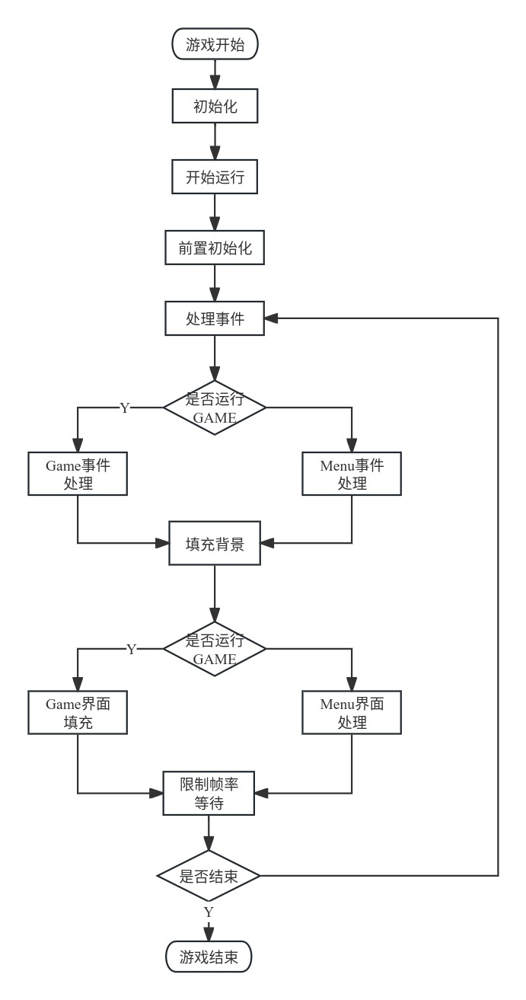

# 介绍
使用pygame写的一些小游戏集合

main.py是主程序，在这里配置有哪些游戏
manager.py是游戏管理器，负责管理游戏的运行，game.py是游戏基类，所有游戏都继承自这个类
test_game.py是测试游戏，可以用来测试游戏的运行效果
my_ui.py是自定义实现一部分悬浮和点击效果的UI组件
defines.py是一些常量定义和通用逻辑

每一个游戏的具体实现思路在各个游戏的__init__.py文件中或者游戏的主文件中

游戏整体流程如下：

着重说明下游戏界面绘制，每一帧界面绘制都是先处理事件，然后将要绘制的结果保存，最后刷新屏幕时再绘制，这样做的原因有两点:
1. pygame没有所谓GUI逻辑，所以一些UI效果变化实现就是通过填充背景覆盖上一帧内容然后在重新绘制当前帧界面效果
2. 最后统一绘制也可以简化UI相关内容的关注

# 游戏UI
此处封装了3个UI常用的组件
My_SurfaceUI 增加了一个判断界面是否有变动，可以减少不必要的界面刷新
My_Button 按钮组件，实现了按钮的悬浮，点击颜色和尺寸的变化效果，以及点击事件的触发
My_Text 文本组件，实现了文本的悬浮，点击颜色和尺寸的变化效果，以及点击事件的触发

# 其他说明
因为游戏每次变化是绘制所有内容，有些游戏不想每次都一个个遍历数据来重复调用blit（比如txz模块的实现），可以自定义一个平面对象，所有绘制和更新到该平面，最后把平面绘制到游戏的场景上。  
需要注意的时，如此可能对于按钮文本一些悬浮变化效果会存在旧的效果残留（按钮没有尺寸位置变化的话还是可以的，新效果刚好覆盖旧效果）

# 安装依赖
pip install pygame,numpy

# 运行游戏
cd minigame  
python3 main.py